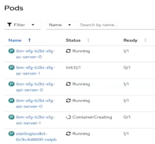

# B2Bi Foundational Capabilities 
### Proof Points

1. Self-healing

    - First Delete a pod. Go to Openshift cluster on the administrator section and click on Workload drop down menu and click on Pods.
      On the Pods select the tools namespace
   
         <!--  --> 
      
      
    - After pod is deleted, pod is reinstantiated and processing work as part of the deployed Sterling B2B Integrator cluster.

    >💡 **NOTE**     
    > While the pod is being terminated a new pod is being created.
    > Let say we kill one of the pods or it crashes.
    > Openshift will automatically create a new pod to replace the deleted pod
      
      
      
      
          
   

2. Upgrade/Rollback 

    - Shorten upgrade processes to lessen downtime.
    - If something goes wrong- then roll back to previous version.
    - Newly instantiated version is processing work as part of the deployed Sterling B2B Integrator cluster and subsequently reverted back to the earlier running version.
    - Let say We want to upgrade to a new fix pack.
    - Go to the Sterling app Check the current version which is version `6.1.0.0`. Now if we want to upgrade, we need to update the `values.yaml` file in git.
    - To access the values.yaml file follow these steps

    - Step 1:

    ```bash
    cd multi-tenancy-gitops-services/instances/ibm-sfg-b2bi/
    ```

    - Step 2:
    - Inside `values.yaml`, find & set 
    - Upgrade the version from `6.1.0.0` to `6.1.0.1`

  
      

    - The upgrade will remove and terminate pods from the previous version. 
    - Argocd will detect these changes and create a new pod with the latest version.


        
        
                

         
     - To verify the version simply go to the Sterling app menu and click on the little support button.   

3. Horizontal Pod Autoscaling
    - Newly instantiated pod is processing work as a part of the deployed Sterling B2B Integrator cluster.
    - Dynamically scale based on load/peak processing 
    The app can scale up and down manually or automatically
    - This option gives the max number of pod and mini number of pods we want to create based on workload and CPU usage.
    - Let go to git and make changes on the values.yaml file.
    - Set the replicaCount: 2 and enable autoscaling to True for both asi and ac components:

    ```yaml
      minReplicas: 2
      maxReplicas: 4
      targetCPUUtilizationPercentage: 60
    ```
  - Step 1:
    ```bash
    cd multi-tenancy-gitops-services/instances/ibm-sfg-b2bi/
    ```
  - Step 2:
    - Inside `ibm-sfg-b2bi-overrides-values.yaml_template`, find & set

    ```yaml
    asi:
      replicaCount: 1

      resources:
        limits:
          cpu: 4000m
          memory: 8Gi
        requests:
          cpu: 2000m
          memory: 4Gi

      autoscaling:
        enabled: false
        minReplicas: 2
        maxReplicas: 4
        targetCPUUtilizationPercentage: 60
    ```
      
> 💡 **NOTE**  
> Push the changes & sync ArgoCD.
   
      
  - If a pod start using more than 60% of the allocated CPU is going to spin up a new pod
    
       
  - Next, Go to the Openshift cluster on the drop down and search under HorizontalPodAutoscaler, you will see the new asi and ac autoscaler.

      
        
  - Next option, Let say we want to change the `targetCPUUtilizationPercentage: 20`
  - Openshift will spin up another pod to the max of `4`.
  - If we look at the cluster new pods are been spined up to the max of `4`
